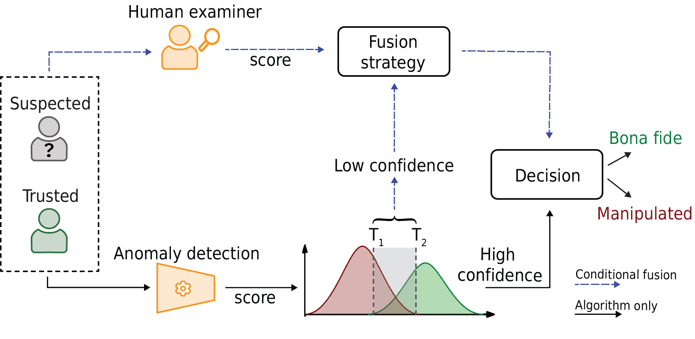
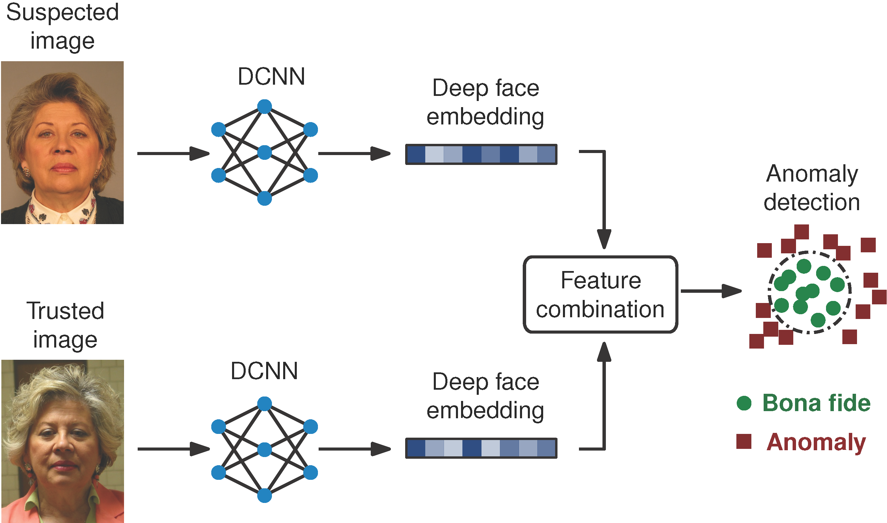

# Algorithm Data for the Darmstadt Face Manipulation Detection Tests

Algorithm data from the **Darmstadt Face Manipulation Detection Tests** (DFMD) used in the paper [*Conditional Face Image Manipulation Detection: Combining Algorithm and Human Examiner Decisions*](https://dl.acm.org/doi/10.1145/3658664.3659649), published in *ACM IH&MMSec 2024*.

<p align="center">
  
</p>

## Introduction

This repository provides algorithm scores for each trial from the Darmstadt Face Manipulation Detection Tests (DFMD 1 and DFMD 2), as referenced in the paper *Conditional Face Image Manipulation Detection: Combining Algorithm and Human Examiner Decisions*.

The available files contain only algorithm scores. The human examiner scores and data used in [2] will be made available once this paper is published. Trial IDs are consistent across datasets, allowing cross-referencing of human and algorithm scores.

---

## Algorithm

The algorithm implemented is based on the **Differential Anomaly Detection Algorithm** proposed in [3]. It leverages a **Variational Autoencoder (VAE)** with a subtraction fusion scheme to enhance detection capabilities. A high-level overview of the method is included below.

<p align="center">
  
</p>


---

## Data Overview

The repository includes the following files:

- **`dfmd1_anomaly_scores_vae_sub_cleaned.csv`**: Contains algorithm scores for DFMD 1.
- **`dfmd2_anomaly_scores_vae_sub_cleaned.csv`**: Contains algorithm scores for DFMD 2.

### Data Columns

| Column Name     | Description                                                                                   |
|------------------|-----------------------------------------------------------------------------------------------|
| `trial_id`      | Unique ID of the trial, which includes both a suspected and a trusted face image.             |
| `suspected_type`| Type of suspected image in the trial (e.g., *bonafide*, *morphing*, *face swap*, or *retouching*). |
| `score`         | Normalized algorithm score obtained on the trial.                                                     |

---

## Citation

If you use this data or our work usefull, consider citing the following works:

[1] **Conditional Face Image Manipulation Detection: Combining Algorithm and Human Examiner Decisions**

```
@inproceedings{Ibsen-DFMDManipulationDetectionHumanAlgFusion-2024,
  Author       = {M. Ibsen and R. Nichols and C. Rathgeb and D. J. Robertson and J. P. Davis and F. L{\o}v{\aa}sdal and K. Raja and R. E. Jenkins and C. Busch},
  Booktitle = {{ACM} Workshop on Information Hiding and Multimedia Security},
  Title        = {Conditional Face Image Manipulation Detection: Combining Algorithm and Human Examiner Decisions},
  Year         = {2024}
}
```

[2] **The super-recogniser advantage extends to the detection of digitally manipulated faces**

```
@misc{David-DFMDSuperRecogniserAdvantage-osf-2024,
 title={The super-recogniser advantage extends to the detection of digitally manipulated faces},
 url={osf.io/preprints/psyarxiv/ye7ph},
 publisher={PsyArXiv},
 author={J. P. Davis and R. Nichols and D. J. Robertson and M. Ibsen and others},
 year={2024},
 month={Nov}
}
```


[3] **Differential Anomaly Detection for Facial Images**

```
@inproceedings{Ibsen-PAD-DiffAnomalyDetection-WIFS-2021_1,
 Author = {M. Ibsen and L. J. Gonzalez-Soler and C. Rathgeb and P. Drozdowski and M. Gomez-Barrero and C. Busch},
 Booktitle = {{IEEE} Intl. Workshop on Information Forensics and Security ({WIFS})},
 Title = {Differential Anomaly Detection for Facial Images},
 Year = {2021},
}
```